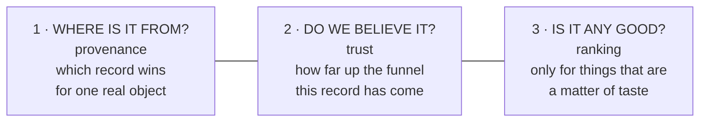
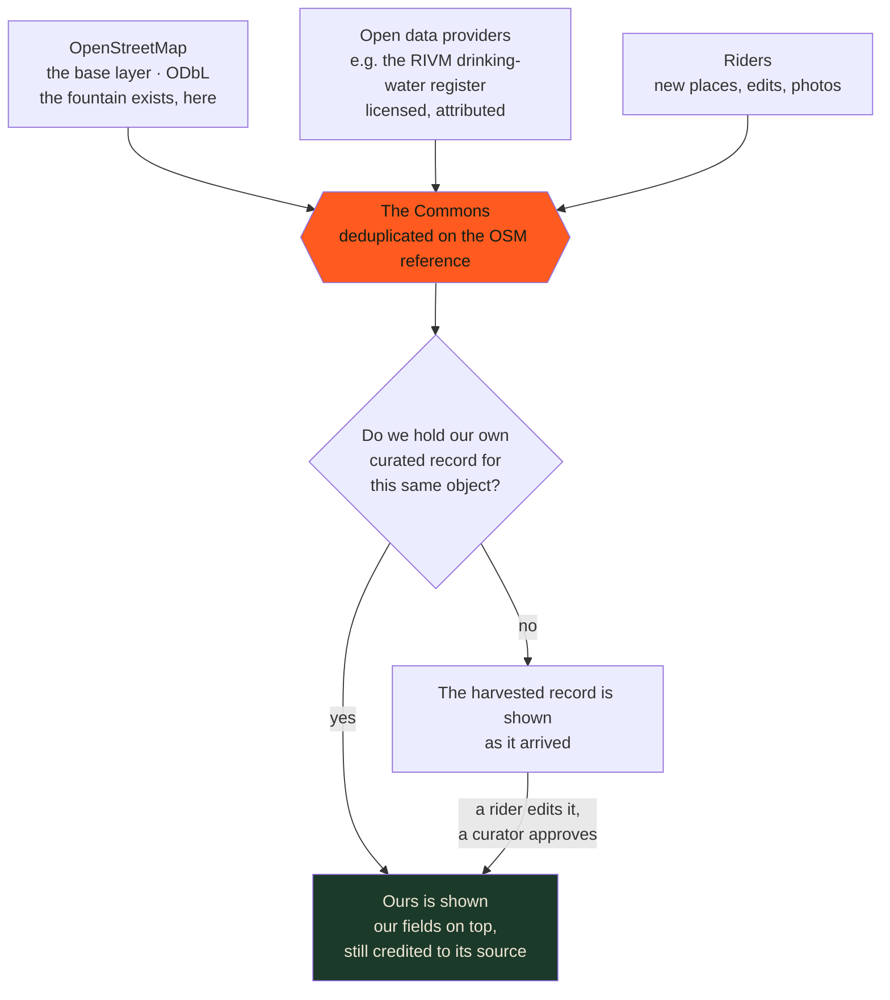
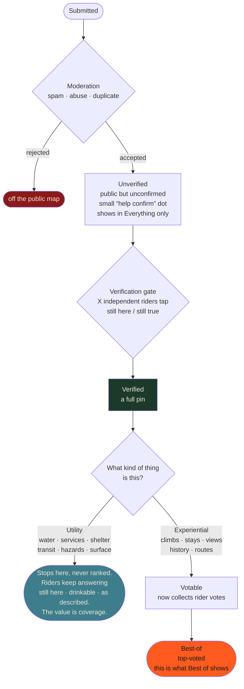
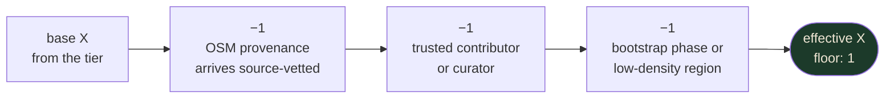
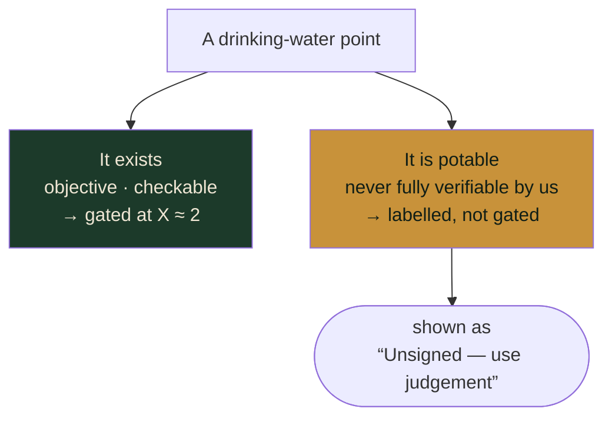
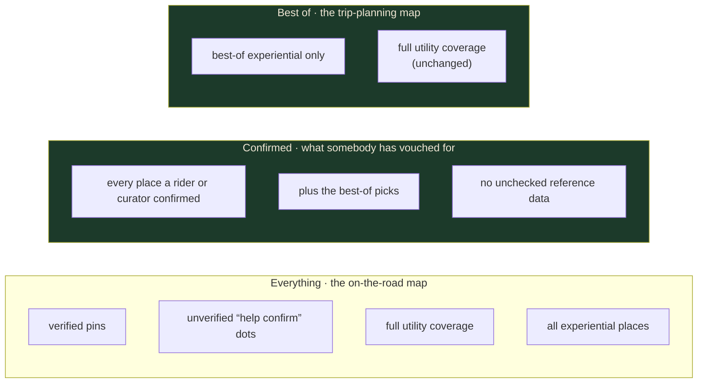
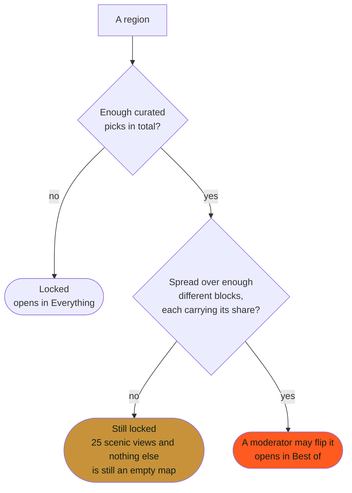
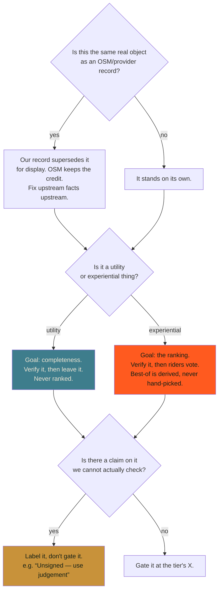

<!-- SPDX-License-Identifier: CC-BY-SA-4.0 -->

# How data earns its place

Everything on the map has a source, a level of trust, and, for some things, a
ranking. Those are **three separate questions**, and the single most common
misunderstanding is treating them as one ladder.

They are not. A rider's vote does not "beat" OpenStreetMap. They answer
different questions entirely:

<!-- CODE-ILLUSTRATIVE mermaid diagram source, rendered by javascripts/diagrams.js -->

If you remember one thing: **provenance decides which row you see, trust decides
whether you see it at all, ranking decides what order the good ones come in.
Ranking only exists for subjective things.**

---

## 1 · Provenance: which record wins

We do **not** copy OpenStreetMap and edit our copy. We *reference* it, and our
own additions sit alongside. When the same real-world object exists in both, the
rider sees it **once**, as the curated record.

<!-- CODE-ILLUSTRATIVE mermaid diagram source, rendered by javascripts/diagrams.js -->

!!! note "One record, one credit"
    A row carries exactly one source, so the drawer's *Source* line names one
    body, never a stack. A tap the RIVM published reads *RIVM*; a tap
    OpenStreetMap holds reads *OpenStreetMap*; a tap a rider added reads as a
    rider source. A rider who edits an OSM or RIVM row is named as the
    contributor beside it and the row keeps its publisher's credit: approving
    the edit does not make the row ours to sign.

    What the *pin* says is a separate question. A dashed pin with a `?` means
    nobody has confirmed the place yet, whatever published it, so both branches
    above can wear one.

!!! note "What this means for a curator"
    Approving a rider's edit to an OSM-sourced place does not change OSM and does
    not delete anything. It creates **our** record for that object, which from
    then on is what the map shows. The OSM attribution stays.

**Upstream fixes belong upstream.** If the underlying geometry or the basic fact
is wrong in OSM, the honest fix is an OSM edit, not a Commons override that
quietly diverges forever.

### The seven sources, by name

Three boxes is the shape. In the database each row carries one of seven
values, and they are what a drawer's citation line is built from:

| Value | What it is | Cited as |
|---|---|---|
| `manual` | Hand-authored by us. A seeded hero pin, a demo route. The harvest never touches it | rider |
| `user` | A rider added or edited it through the app | rider |
| `scout` | A rider's ride trace suggested it. How it arrived, not proof: the server never saw the ride file | rider |
| `authority` | A publisher of record for the thing mapped, named in the provider registry. Two at the time of writing: Géoportail Wallonie PIVOT (Tourisme Wallonie, official accommodation in Belgium, letter O, CC BY 4.0) and the RIVM drinking-water register (the Netherlands, letter B, public domain) | the publisher: Tourisme Wallonie, RIVM |
| `wikidata` | Anchored to a Wikidata entry | Wikidata |
| `osm` | Straight from the harvest. Most of the map | OpenStreetMap |
| `auto` | Our own pipeline computed it, for example a surface stretch. Deleted and rebuilt wholesale, never edited in place | derived |

The first three are the ones the map calls **rider** sources. The rest keep
their upstream citation, which is why approving a rider's edit to an OSM place
does not remove the OpenStreetMap credit: it adds ours beside it.

!!! note "Which row wins is a separate question again"
    When two rows turn out to describe one real place, the duplicate guard keeps
    one, in the order above, top to bottom. That is a *bookkeeping* rule, not a
    quality judgement: a brand-new `manual` pin outranks a long-verified `osm`
    row, because the question being asked is "which of these two records is ours
    to keep", never "which is better". Specified in
    `docs/specs/catalog-data-model.md` §5 and §5a.

!!! warning "A photograph is not a source"
    These seven say where a *place record* came from. A photo of that place is
    not a place, and adding one never changes the row's source. Photos arrive
    two ways, and they are handled differently.

    A **Wikimedia Commons image** reached through OpenStreetMap or Wikidata is
    shown beside the record it illustrates, carrying its own credit and its own
    licence per file: the drawer links it straight from Commons, and the media
    pipeline keeps a licence-checked, scanned copy of it in our own store. That
    one is not a rider contribution and does not enter a moderation queue,
    because there is no contributor and nothing was submitted.

    A **rider's own upload** is a contribution. The bytes go to a private
    quarantine, get scanned, and the photo waits in the moderation queue until a
    moderator accepts it, exactly like any other submission. Specified in
    `docs/specs/photo-uploads.md`.

    What neither kind does is prove anything. A picture is not evidence that the
    place exists, sits where the row says, or still works. Only the funnel below
    settles that, and it takes riders standing there, not pixels.

---

## 2 · Trust: the funnel every record climbs

Nothing arrives trusted. Everything climbs the same funnel, and **two kinds of
thing get off at different stops**.

<!-- CODE-ILLUSTRATIVE mermaid diagram source, rendered by javascripts/diagrams.js -->

!!! warning "A water tap is never 'best-of'"
    Utility types **stop at Verified, permanently**. You do not rank a drinking
    fountain: you want to know it is there. Ranking is the whole point for a
    climb: you want the best ten, not all two hundred.

!!! note "A confirmation is not a vote"
    Stopping at Verified does not mean the row goes quiet. Utility rows keep
    taking rider input for as long as they exist; what they never take is a
    ranking. `ConfirmationStance` holds the whole vocabulary, four answers:
    **drinkable** and **not drinkable** on water, **still here** on anything a
    rider can stand in front of, and **not as described** on a road surface,
    which is a warning rather than a vouching and counts in the tally without
    verifying anything. A reported closure carries the reporter's own answer to
    "closed for how long?" and retires itself when that runs out.

    Every one of those answers a question of *fact*: is this row still true
    today. A vote answers a different question, which of two true things is
    better, and that question only means anything on the experiential branch. A
    climb takes both, because "it is there" and "it is worth your weekend" are
    not the same claim.

!!! note "What of this funnel is running today"
    The funnel above is the design. Most of it is live, and where the shipped
    numbers differ from the tiered X further down, the numbers here are the
    ones the map actually uses:

    - **Routes gate exactly as described.** Three independent riders tapping
      *I rode this* promotes a route from Unverified to Verified, the count
      excludes the proposer, and the threshold is an admin setting rather than
      a constant.
    - **A place gates on two riders.** Two riders confirming a place promote it
      from Unverified to Verified, which is what takes the `?` off its pin. The
      submitter's own answer never counts, a *not drinkable* or *not as
      described* warning never counts, and one row per rider is a database
      constraint, so the same person tapping twice can never add up. The number
      is one global admin setting, `map.item_verify_threshold`, and it is lower
      than the route threshold on purpose: "I rode this whole route" is a bigger
      claim than "this tap is here".
    - **A curator's own confirmation settles it.** When the person confirming
      holds curator rights, the place becomes Verified on that one answer. Three
      riders should not be needed to agree that a castle is a castle, and a
      curator standing at a place is the strongest signal the system has.
    - **The `?` and the record say the same thing.** There is one definition of
      verified and it is the record's own state, read by the map, the public API
      and the Best-of readiness gate alike. Until September 2026 each of those
      carried its own extra clause, so a single tap could clear the badge on a
      row the database still called Unverified, and a listing in an official
      register counted as verified with nobody having stood there. Both are
      gone: whatever published a row, it leaves Unverified the same way.
    - **Anything you can stand in front of can be confirmed.** The old rule
      asked whether a place could *vanish*, which excluded castles and
      mountains. The right question is whether a rider was there and this is
      right about its existence, its position and its name. A climb can be wrong
      about all three. An invented viewpoint with a generated photo is exactly
      what the next rider at that spot disproves.
    - **Two clocks age a place, and only one of them takes it off the map.**
      *Retirement* is built for closures. A hazard reported as *Road closed*
      carries the reporter's own answer to "closed for how long?", today, days,
      weeks or months, and retires itself once that window passes, unless
      somebody confirms it is still shut, which restarts the clock. Retired
      means it stops being shown, not deleted: the closure was true when it was
      reported, and keeping it is what makes a repeat closure legible next
      year. A hazard with no stated end date still needs a human to clear it.
    - **Freshness is the second clock, and it removes nothing.** Every type
      where the built world ages carries the age of its newest confirmation:
      water, bike services, where to sleep, getting there, shelter, public
      toilets, hazards and road surface. Half the window in, the row reads
      *ageing*; at the full window it reads *stale* and the pin wears an orange
      ring. Views, history and climbs take no freshness at all, because a
      viewpoint does not stop being a view. The window is one global admin
      setting, `map.confirmation_stale_months`, six months today and anything
      from one to sixty.

    The potable/labelling rule in §3 and the view-mode gate in §4 *are* shipped
    as written.

!!! note "An orange ring is a request, not a verdict"
    A stale ring says one thing: nobody has stood there in six months. In a
    region with few riders that will be most of the map, and it should be. The
    honest reading of a thin community is "we do not know", never "it is gone".
    So the ring hides nothing, changes no record, and blocks no view mode. It is
    the map asking for the one tap that clears it.

    A map that is permanently orange is telling you the window is wrong for that
    place, not that the data is bad. `map.confirmation_stale_months` is the
    lever, one to sixty, and it is global: widening it for a quiet country
    widens it for a busy one too. A per-region window is not built.

### How many confirmations is X?

What shipped is **two numbers**: a place takes `map.item_verify_threshold`
riders, two today, whatever its type, and a route takes
`route.ride_verify_threshold`, three. No tiers, no modifiers. The design below is
where the tiers would go if two blunt numbers turn out to be too blunt, and the
safety row is the one it already contradicts: a hazard needs the same two riders
as a water tap today, and decay does the rest.

| Tier | Types | Base X | Why |
|---|---|---|---|
| **Objective utility** | water *exists*, bike services, getting there | ~2 | existence is binary, cheap to confirm |
| **Experiential** | climbs, stays, views, history | ~2–3 | verification only confirms it *exists*; **voting** does the quality filtering, so no punishing bar |
| **Routes** | quality rides | ~3 × *"I rode this"* | the confirmation asserts *I rode it*, not *it exists* |
| **Safety / time-sensitive** | hazards, shelter, the water *potable* flag | ~1 to publish | publish fast, then **decay**, auto-stale after N days unless re-confirmed |

**Modifiers** would adjust the base (never below 1). None of them is built:

<!-- CODE-ILLUSTRATIVE mermaid diagram source, rendered by javascripts/diagrams.js -->

It is a trust ↔ throughput dial. Too low and we verify false positives; too high
and coverage starves in quiet regions.

---

## 3 · Risk lives at the field, not the item

This is the part that surprises people, and it is the answer to *"but what about
potable?"*

**"This fountain exists"** and **"this water is safe to drink"** are two
different claims with two different risk profiles. They do not share a gate.

<!-- CODE-ILLUSTRATIVE mermaid diagram source, rendered by javascripts/diagrams.js -->

We will never certify drinking water. Pretending a rider tap-count makes it safe
would be dishonest, so the map **says what it knows and marks what it doesn't**.
The same principle covers anything we cannot actually check.

!!! tip "The rule"
    If a claim can be confirmed by looking, **gate** it. If it cannot, **label**
    it. Never gate something into looking more certain than it is.

---

## 4 · What the map shows, and when

The view modes are a **density** control, not a trust control. There are three,
and they read the lifecycle above from the top down.

<!-- CODE-ILLUSTRATIVE mermaid diagram source, rendered by javascripts/diagrams.js -->

**Confirmed is the middle rung**, and it contains Best of rather than sitting
beside it: a curator verifying a place *is* somebody vouching for it. What it
leaves out is the reference layer, the OpenStreetMap data we mirror but nobody
here has checked, because a mode meaning *someone looked at this* cannot carry
the one layer where nobody has.

That also means Confirmed starts nearly empty in a new region, and stays that
way until riders fill it. We would rather show you an honest empty screen than
imply a check that never happened; it is also the one screen that makes pressing
*Confirm* worth something.

**Search always reaches everything, in both modes.** "Too much" is solved by
ranking and collapsing, curated first and community tagged, never by hiding.

### Which mode a region opens in

A region opens in **Everything** by default. Best of is something a region
*earns*, because a best-of map of an uncurated region is an empty map, and an
empty map reads as "there's nothing here" even when the rail says 1,488 places.

A moderator can flip a region to open in Best of once it has enough curated
content, **spread across enough kinds of content**:

<!-- CODE-ILLUSTRATIVE mermaid diagram source, rendered by javascripts/diagrams.js -->

The **blocks** are the data layers themselves: road surface, climbs, where to
sleep, scenic views, history & culture, best-of routes. Utility layers do not
count towards readiness, because they render in *both* modes: a full map of
water taps is no evidence that Best of has anything to show.

Breadth is *"N blocks of M"*, not *"every block"*, on purpose. A Dutch province
has no climbs and never will, and must still be able to qualify on stays, views,
history and routes.

The exact numbers are **set in the admin**, not in code. An administrator opens
*System configuration* and changes the total, how many blocks must contribute,
and how much each must carry; the new numbers apply from the next page load,
with no deploy and no restart, and every change is recorded with its old and
new value. The Regions desk shows every region's count per block and states
exactly what is still missing.

This is the general rule, not a special case for this one gate: the numbers the
site runs on (this readiness gate, how many routes a region may have live at
once, how many riders must confirm a route before it verifies itself, how long
decided moderation items are kept) are all editorial decisions, and editorial
decisions belong to the people making them rather than to a release cycle.

---

## The short version, for curators

<!-- CODE-ILLUSTRATIVE mermaid diagram source, rendered by javascripts/diagrams.js -->

!!! danger "Best-of is derived, never hand-picked"
    Moderation is a **spam/abuse/duplicate gate**, not a quality ranking. What
    rises to best-of is decided by riders' votes. The one deliberate exception is
    **routes**, where supply *is* editorially reviewed in the Routes queue, and
    riders then rank within that reviewed set.

---

**Where this is specified.** The lifecycle and the X tiers:
`docs/specs/edit-items/README.md`. Provenance and deduplication:
`docs/specs/osm-data-architecture.md`. What the map shows:
`docs/specs/map-and-search.md`, §4.2 for the view modes and the
Best-of-by-default gate.
