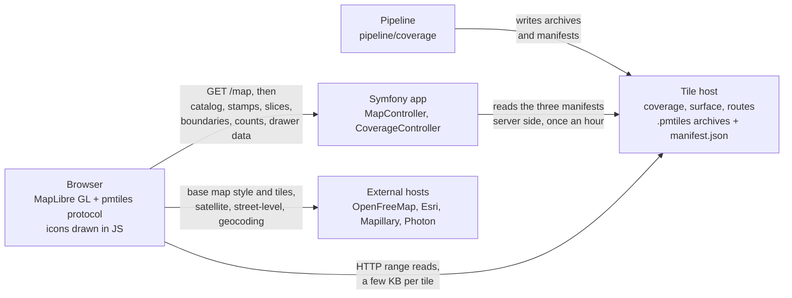
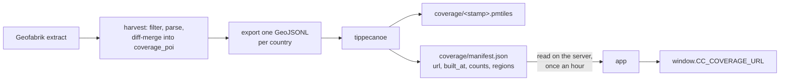

<!-- SPDX-License-Identifier: CC-BY-SA-4.0 -->

# The map page, request by request

Open `/map` with the browser's network tab showing and you see about thirty
requests to four different places. This page says what each one is, who
answers it, and in what order they happen. It is the map read from the wire,
where [Putting it on screen](gis/on-screen.md) is the map read from the code.

## Who serves what

Three parties answer the page. The application builds the HTML and answers
every JSON call. A tile host holds the archives the pipeline built. A few
external hosts supply the base map, satellite imagery, street-level photos and
geocoding.

<!-- CODE-ILLUSTRATIVE mermaid diagram source, rendered by javascripts/diagrams.js -->

Two facts on that picture explain most of what follows. The pipeline writes
both database rows and tile archives. The browser reads the archives straight
from the tile host, with no application server in that path.

## Boot order

1. **`GET /map`.** `web/src/Controller/MapController.php` reads the coverage,
   surface and routes manifests through `web/src/Coverage/CoverageManifest.php`,
   `web/src/Coverage/SurfaceManifest.php` and `web/src/Coverage/RoutesManifest.php`,
   each cached for an hour, and embeds the archive URLs in the page as
   `window.CC_COVERAGE_URL`, `CC_SURFACE_URL`, `CC_SURFACE_TODO_URL`,
   `CC_SURFACE_GAPS_URL` and `CC_ROUTES_URL`. The page also carries the
   catalog version tag, the basemap icon registry, the viewer's home area and
   the UI strings.
2. **Scripts.** MapLibre GL and the pmtiles library from our own origin, then
   `web/assets/map/map.js` and its modules through the importmap.
3. **MapLibre boots** with the style `https://tiles.openfreemap.org/styles/liberty`.
   That one request returns the style document; the base map tiles follow
   as the view needs them.
4. **Catalog and stamps, in parallel.** `web/assets/map/catalog-load.js` fetches
   `/map/catalog.json?v=<tag>` and `/map/catalog/stamps.json` at the same
   time. The stamps document is small and always revalidated. Every region in
   the active scope whose live stamp differs from the one baked into the
   catalog is refetched as `/map/catalog/region/{rid}.json?v=<stamp>` and
   spliced over the cached document.
5. **Icons.** `web/assets/map/icons.js` draws each pin on a canvas and hands
   the pixels to MapLibre with `map.addImage`. No image file is requested.
6. **Archives.** `web/assets/map/coverage.js`, `web/assets/map/surface-tiles.js`
   and `web/assets/map/routes-tiles.js` register `pmtiles://` sources for the
   URLs from step 1. The pmtiles protocol reads each archive's header once,
   then fetches only the tiles in view, each as an HTTP range request.
7. **Scope.** When a region is chosen, `web/assets/map/spotlight.js` fetches
   `/map/region/{slug}/boundary` for the region and `/map/scope/boundary?rids=`
   for its neighbours, and `web/assets/map/coverage.js` fetches
   `/map/coverage/counts?rids=` for the letter counts in the icon rail.
8. **On demand.** Everything else is fetched when the visitor acts: a click on
   a point, a search, the drawer, the Curated facet, community actions.

## Every request

Three tables, one per party. Paths are shortened to what tells them apart;
the host is in the heading.

**Answered by the application**, `MapController` and `CoverageController`:

| Request | What it carries | Cached |
|---|---|---|
| `GET /map` | the page, with the `window.CC_*` values embedded | private |
| `/map/catalog.json?v=` | the whole served catalog, every region, letters keyed, plus the region stamps | one hour, ETag, URL-versioned |
| `/map/catalog/stamps.json` | `{ "<region id>": "<stamp>" }`; key `"0"` is the rows that belong to no region | no-cache, ETag |
| `/map/catalog/region/{rid}.json?v=` | one region's rows, in the catalog's shapes | one hour, ETag, URL-versioned |
| `/map/region/{slug}/boundary` | one region's border as GeoJSON | public |
| `/map/scope/boundary?rids=` | several borders in one call | public |
| `/map/coverage/counts?rids=` | how many coverage points of each letter fall in the scope | one hour |
| `/map/coverage/poi/{type}/{id}` | one point's details for the drawer | public |
| `/map/coverage/photo/{type}/{id}` | the photo attached to a point | public |
| `/map/coverage/nearby?lat=&lng=` | points around a place, for the places panel | public |
| `/map/coverage/search?q=` | point search by name | public |
| `/map/heat.json` | heat points, off by default | public |
| `/map/best-of?season=&bike=` | ranked verified routes for the Curated facet | five minutes |
| `/map/item/{id}/history` | an item's change log for the drawer | one minute |
| `/map/item/{id}/hidden-photos` | photos withheld from an item, for curators | private |
| `/items/{id}/…`, `/routes/{id}/…` | community actions, confirmations, decisions | private, POST |

**Read from the tile host by HTTP range**, a few kilobytes per tile. Every
key is immutable: a new build is a new key.

| Archive | What it carries |
|---|---|
| `coverage/<stamp>.pmtiles` | the coverage points, one layer per country code, named `<letter>_<cc>` |
| `surface/<stamp>/classified.pmtiles` | roads whose `surface` tag is known, canonicalised |
| `surface/<stamp>/todo.pmtiles` | roads whose surface nobody has recorded |
| `surface/<stamp>/gaps.pmtiles` | the same question as a grid, for planning zoom |
| `routes/<stamp>.pmtiles` | cycle-route network lines and knooppunt numbers |

**External hosts**, each tied to one feature:

| Host | Request | What it carries |
|---|---|---|
| OpenFreeMap | `styles/liberty` | base map style document |
| OpenFreeMap | `planet/<date>/{z}/{x}/{y}.pbf` | base map vector tiles |
| Esri | `World_Imagery/.../{z}/{y}/{x}` | satellite tiles, only after the viewer turns satellite on |
| Mapillary | `mly1_public/2/{z}/{x}/{y}` | street-level coverage lines |
| Mapillary | `graph.mapillary.com/images` | "is there a photo here" lookups |
| Komoot | `photon.komoot.io/api` | geocoding for the search box |

Every host the page may talk to is listed in the Content Security Policy, in
`web/src/EventSubscriber/CspSubscriber.php`. A new host is a CSP change first.

The stamps document is what keeps the catalog fresh without redownloading
it. The worldwide catalog is about a megabyte gzipped (the
[numbers page](numbers.md) keeps the current figure); a region's slice is a
few tens of kilobytes. A curator's decision moves one region's stamp, and a
visitor in that region fetches that slice and nothing else.

## What you will not see, and why

- **Icons.** They are drawn on a canvas and pushed into MapLibre. There is no
  sprite file and no icon request.
- **`manifest.json`.** The application reads it on the server. The browser only
  ever sees the archive URL that came out of it.
- **A `data:image/svg+xml,...` entry** with a crosshair path and `fill=#333`.
  That is MapLibre's own stylesheet inlining the icon of its "locate me"
  control. Nobody serves it.
- **Whole archives.** An archive is tens of megabytes, but the browser reads a
  small header and then a few kilobytes per tile. The size the network tab
  shows is what was read, not the file.

## Where the tile data comes from

<!-- CODE-ILLUSTRATIVE mermaid diagram source, rendered by javascripts/diagrams.js -->

The surface and routes archives take the same path without the database: the
extract is their input, an archive plus their own manifest is their output.
The stamp in the key is the build time, so every build is a new immutable URL
and the manifest is the only thing that moves. The runbooks in
[Data operations](data-ops/index.md) cover how the archives are built.

## Development against production

| | Development stack | Staging and production |
|---|---|---|
| Application | `localhost:8001` | the site |
| Tile host | MinIO, `localhost:9100/cc-maps/...` | the object storage behind `COVERAGE_PUBLIC_BASE_URL` |
| Base map, satellite, Mapillary, geocoding | the same external hosts | the same |

The page is identical. Only the two origins differ, and the network tab shows
you which is which.
