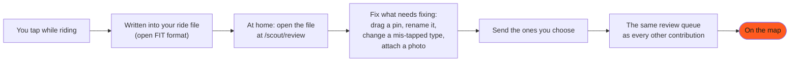

<!-- SPDX-License-Identifier: CC-BY-SA-4.0 -->

# Scout: tagging while you ride

Most of what the Commons knows started as something a rider noticed in passing:
the tap in the square works, the gravel starts here, that bridge is shut.
Knowledge like that normally evaporates by the time you get home.

**Scout** is the one-tap field recorder that catches it. It runs on your bike
computer or your phone, and it writes what you mark straight into the activity
your device was already recording.

!!! info "Scout stands alone"

    The app and its file format work **with or without** the Cycling Commons.
    Your tags are yours, in your own ride file, in an open and documented
    format that anything can read. Sending them here is a choice you make
    afterwards, one tag at a time.

## What you can tag

Six types, plus one that needs no tapping at all.

| Tag | What it is for |
|---|---|
| **Resupply** | Water, food, or a bike-repair and pump stop. |
| **Closure** | Road shut or a detour, and roughly how long you think it will last, which is what lets the map retire it by itself later. |
| **Surface** | Mark a stretch with a start type and an END, so it is recorded as a segment rather than a point. Aligned to OpenStreetMap surface values. |
| **Notice** | A bad corner, a junction, potholes, or anything else sketchy. |
| **Scenery** | A view worth remembering. |
| **Other** | Everything else. Single tap, no submenu: decide what it was when you get home. |
| **Overtakes** | With a Varia-compatible radar paired, Scout counts the vehicles that pass you, automatically. It is the closest thing there is to an objective measure of how busy a road really feels. |

A tag takes one press. The submenu (*which* resupply, *which* surface) is
optional: skip it and sort it out later.

## How a tag becomes a place on the map

<!-- CODE-ILLUSTRATIVE mermaid diagram source, rendered by javascripts/diagrams.js -->

Nothing is sent from the road. You open the ride when you get home, look at what
you marked, and decide, tag by tag, what is worth sharing. A tag you never
approve simply stays in your file.

The review screen needs an account: `/scout/review` asks you to sign in first,
because sending a tag from it is a contribution from your account, like any
other. The sign-in is for what you send; the file itself still never leaves your
browser (see below).

Once sent, a Scout tag is an ordinary contribution: the same form fields, the
same curator, the same queue as a place typed in by hand. There is no fast lane
and no separate standard of proof: a new way of collecting facts must not bring
a new way of judging them ([Contributing](contributing.md),
[How data earns its place](data-priority.md)).

## Your ride stays yours

This is the part worth being precise about, because it is a promise about
*where your data goes*, not a policy we could quietly change later.

- **The ride file is never uploaded.** The review screen reads it **in your own
  browser**. It is never posted, never stored on a server, and there is nothing
  to expire or delete, because we never had a copy.
- **Only the tags travel**: the point you tapped, what you tagged it as, and
  when. Not the route between them.
- **The overtake count is shown to you, and goes nowhere.** It is measured from
  your own ride file while you look at it. Publishing traffic measurements is a
  design question the project has not answered yet, and until it has, nothing is
  collected.
- A tagged spot is a place you chose to publish. Everything around it (where
  you started, where you live, how fast you ride) stays on your machine. See
  [Location & privacy](location-privacy.md) for the whole picture.

## Where it runs

| Platform | Status |
|---|---|
| Garmin Edge | Available now |
| Android | Coming soon |
| Hammerhead Karoo | Planned |

## What it cannot do yet

Being honest about the edges is more useful than a feature list:

- **A surface stretch has to be finished on the map.** Scout records a start and
  an END, and the review screen names how many stretches a ride carries, but
  sending one from that screen is not built; add it from the map instead.
- **A tag with no GPS fix cannot be placed.** It is counted and named rather
  than silently dropped, so a rider who tapped thirteen times and sees eleven
  pins knows why.
- **Nothing verifies the file.** Because the ride is never uploaded, the server
  can make no claim about the device it came from, so Scout's provenance says
  *submitted through Scout*, never *device-verified*. A Scout ride-claim counts
  exactly as much as a rider clicking *I rode this*, which is the honest
  position when neither can be checked.

## Reading the numbers on a reviewed ride

The review screen tells you about the ride itself:

- **overtakes**, drawn where they happened, each carrying the speed the vehicle
  was doing (its own ground speed, not the difference between it and you), or
  **?** when the radar gave no usable reading;
- **tags with no GPS fix**, counted;
- **surface stretches** recorded.

Speeds follow the unit you set in your profile: kilometres per hour if you read
kilometres, miles per hour if you read miles.
